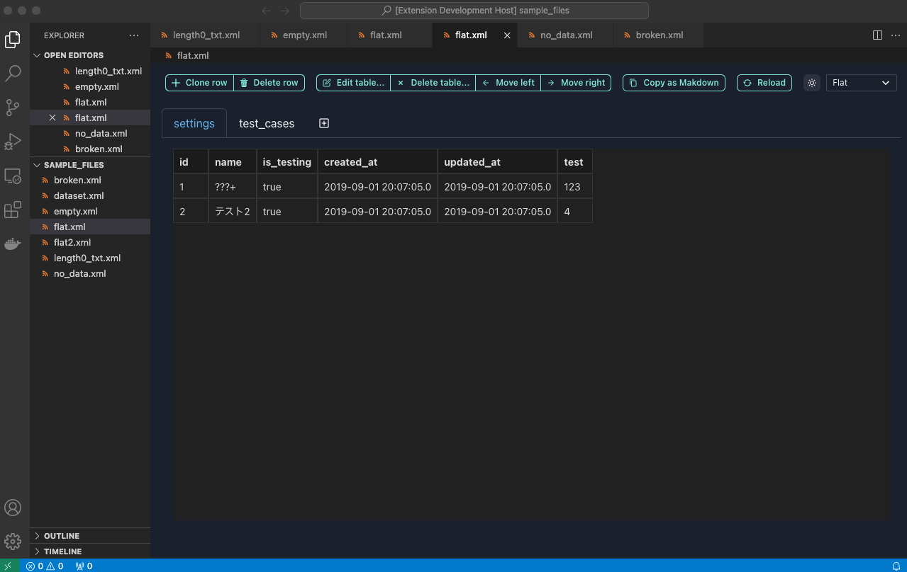
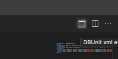
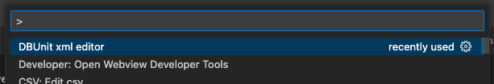

# dbunit-vscode-extension README

This extension allows you to edit xml dataset files with a table ui.
([日本語](./README-ja.md))

## Features

- Supports both flat XML and regular XML formats.
- Exportable in different formats.
- Makes it possible to copy the dataset's contents to the clipboard in Markdown format.

## Usage

After opening the XML file, clicking the table icon in the top right opens the Table UI editor. 

Additionally, it can also be opened from the DBUnit xml editor in the command palette.

### Editing Row Data in the Table

- Double-click on the cell you want to edit to modify its value.
- Pressing the Return key with the cursor in the editing mode allows you to make changes.
- Clicking the Clone row button with the cursor on a data row adds a copy of the selected row below it.
- Clicking the Delete row button with the cursor on a data row deletes the respective row.

### Editing Table Information

- Clicking the Edit table button opens the editing modal, allowing you to change the table name, column names, reorder columns, and delete columns.
- Clicking the Delete table button removes the currently displayed table.
- Using the Move left and Move right buttons, you can adjust the display order of the tables.
- Clicking the + button next to the table name tab displays the table addition form.

### Other Features

- Clicking the Copy as Markdown button converts XML information into Markdown table format and copies it to the clipboard. (Note: Line breaks are not supported.)
- Clicking the Reload button updates the table UI with the file information. Unlike the initial load, it does not automatically reflect information from the file to the UI after the first load. Therefore, use Reload when directly editing the file.
- The sun and moon icons enable toggling between dark and light modes.
- Editing content is written to the file in the XML format selected in the Flat/Standard dropdown.

## License

[MIT](LICENSE)
